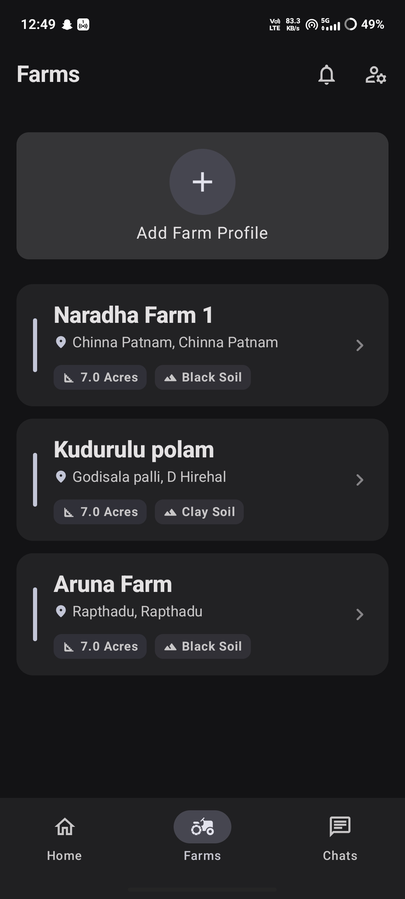
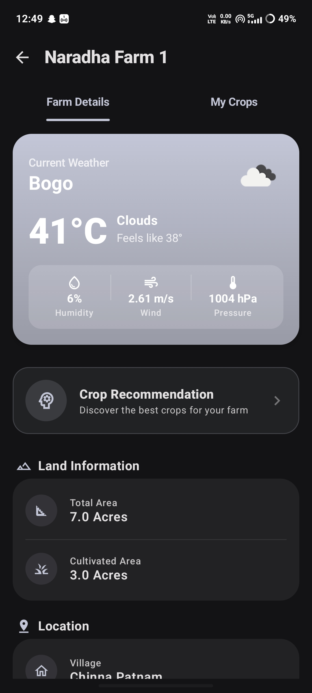
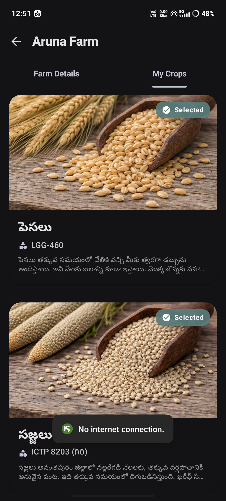
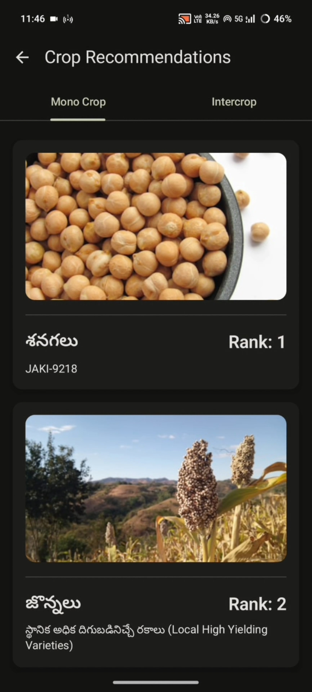
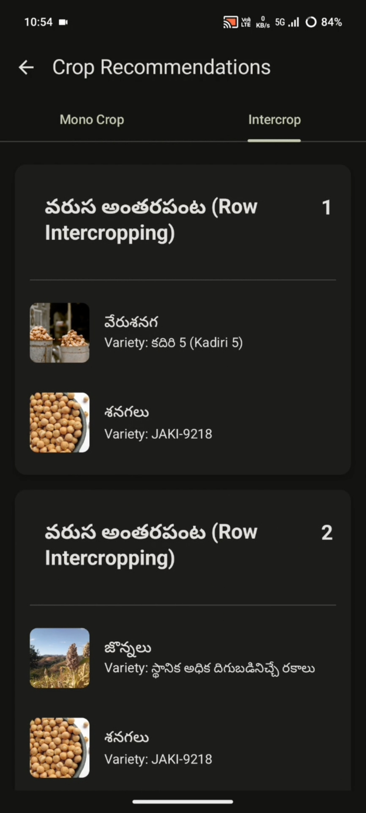
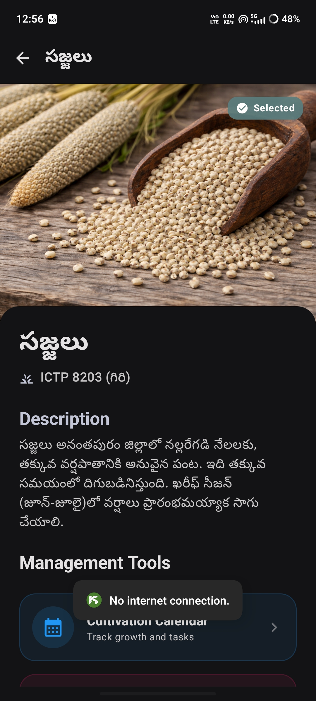
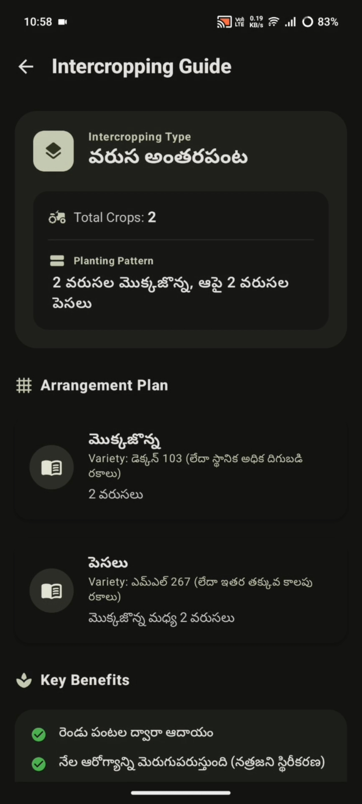
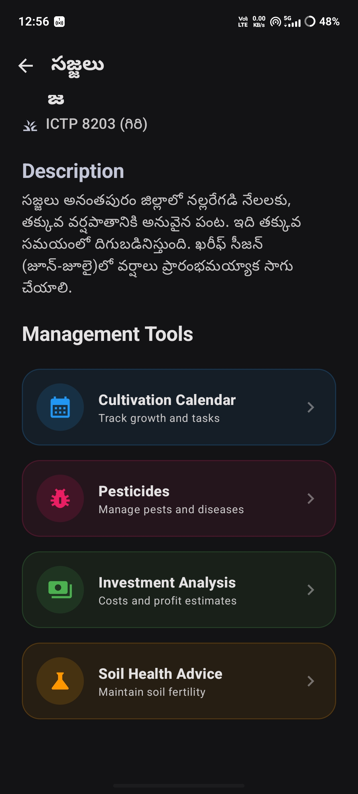
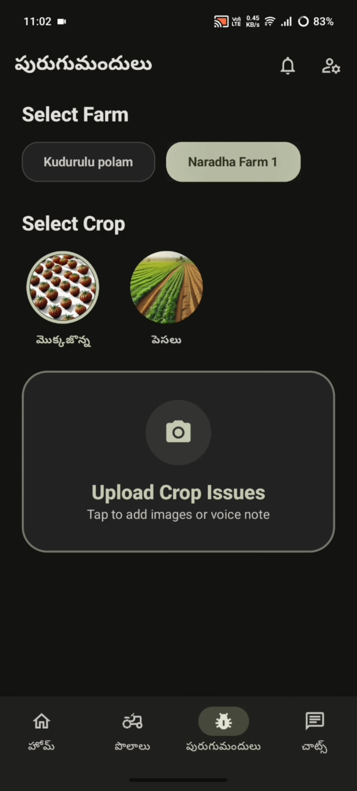
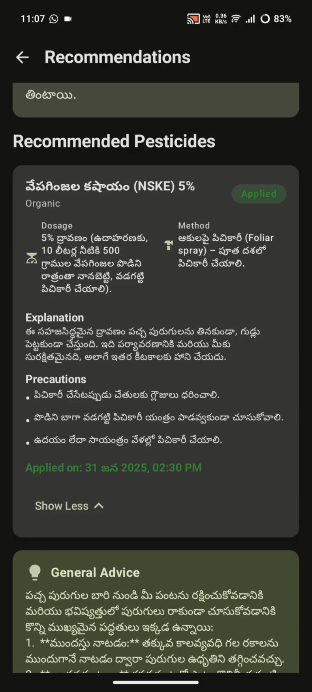

# Kisan Seva AI

## 🏡 Farms Overview

Shows all registered farms with area, soil type, and location.

### Key UI Highlights
- Multiple farm profiles
- Soil type tags (Clay, Black soil, etc.)
- Area displayed in acres
- Clean card-based layout

---

## 🌦️ Farm Dashboard (Weather + Details)

Real-time weather and farm-specific information.

### Includes
- Live weather (temperature, humidity, wind, pressure)
- Crop recommendation entry point
- Total vs cultivated area
- Village, mandal, district details

---

## 🌱 Crops Under a Farm

Displays crops selected for a particular farm.

### Features
- Selected crop status
- Crop image banner
- Variety name and short description
- Supports multiple crops per farm

---

## 🌾 Crop Recommendation – Mono Crop

AI-ranked mono crop suggestions based on soil, weather, and land data.

### Highlights
- Rank-based recommendation
- Crop image preview
- Variety information
- Simple comparison for farmers

---

## 🌾 Crop Recommendation – Intercropping

Mixed crop recommendations with intercropping logic.

### Highlights
- Intercropped badge
- Multiple crops in one recommendation
- Optimized combinations for yield and soil health

---

## 📋 Crop Detail Page

Detailed view of a selected crop.

### Includes
- Crop name and variety
- Local-language description
- Selection status
- High-visual crop imagery

---

## 🧩 Intercropping Detail & Guide

Explains crop pairing and arrangement.

### Tools Available
- Intercropping guide
- Cultivation calendar
- Investment analysis
- Soil health advice

---

## 📅 Cultivation & Management Tools

Centralized tools for crop lifecycle management.

### Features
- Cultivation calendar
- Investment analysis
- Soil health advisory

---

## 🌾 Pesticides Guide

AI-ranked pesticide suggestions based on farm and crop data.

### Highlights
- Rank-based recommendation
- Pesticide image preview
- Variety information
- Simple comparison for farmers

---

## 🌾 Pesticides Recommendation

Three types of pesticide recommendations:
- Chemical
- Organic
- Biological

---
